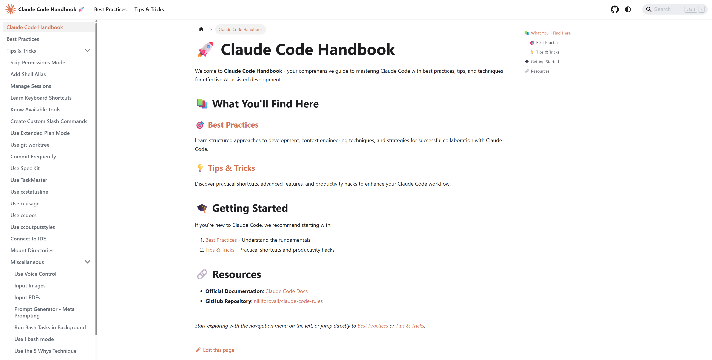

# 📖 [Claude Code Handbook](https://nikiforovall.blog/claude-code-rules/)

[](https://smithery.ai/skills?ns=nikiforovall&utm_source=github&utm_medium=badge)


A collection of [Claude Code](https://docs.anthropic.com/en/docs/claude-code/overview) recommendations and practices.

Learn practical techniques to enhance your AI-assisted development workflow with Claude Code.



## Quick Start

```bash
# Add the marketplace
claude plugin marketplace add nikiforovall/claude-code-rules

# Install plugins
claude plugin install handbook@cc-handbook
claude plugin install handbook-extras@cc-handbook
```

Browse available plugins: [Plugins](https://nikiforovall.blog/claude-code-rules/plugins)
