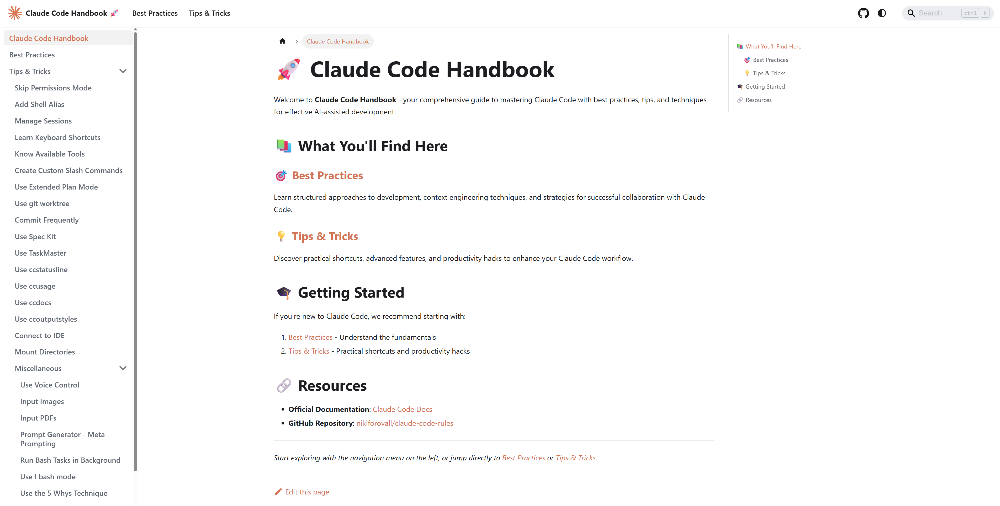

# 🤖 Claude Code Handbook

A collection of [Claude Code](https://docs.anthropic.com/en/docs/claude-code/overview) recommendations and practices.

Learn practical techniques to enhance your AI-assisted development workflow with Claude Code.



## Plugins

This repository contains two plugins:

- **`cc-handbook`** - Core plugin with best practices, commands, agents, and MCP integrations
- **`cc-handbook-extras`** - Experimental and extended features plugin

Plus a marketplace for centralized plugin discovery and installation.

## Quick Start

Use Claude Code's `/plugin` command for the quickest installation:

```bash
# Add the marketplace (one-time setup)
/plugin marketplace add nikiforovall/claude-code-rules

# Install core plugin
/plugin install cc-handbook

# Install extras plugin
/plugin install cc-handbook-extras
```
