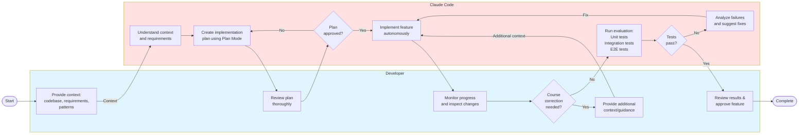

<!-- vscode-markdown-toc -->
* 1. [Learn Shell Keyboard Shortcuts for Text Editing](#LearnShellKeyboardShortcutsforTextEditing)
* 2. [Mount Multiple Directories](#MountMultipleDirectories)
* 3. [Use `git worktree` for parallel development](#Usegitworktreeforparalleldevelopment)
* 4. [Use `git commit` as checkpoints, commit frequently](#Usegitcommitascheckpointscommitfrequently)
* 5. [Run bash tasks in the background](#Runbashtasksinthebackground)
* 6. [Input images](#Inputimages)
* 7. [Use voice control to interact with Claude Code](#UsevoicecontroltointeractwithClaudeCode)
* 8. [Use `#` to add things to the project memory](#Usetoaddthingstotheprojectmemory)
* 9. [Learn how to Configure and Customize](#LearnhowtoConfigureandCustomize)
* 10. [Connect to IDE](#ConnecttoIDE)
* 11. [List Claude Code Tools](#ListClaudeCodeTools)
* 12. [You can use YOLO mode `--dangerously-skip-permissions`](#YoucanuseYOLOmode--dangerously-skip-permissions)
* 13. [Use `/resume` to resume a conversation](#Useresumetoresumeaconversation)
* 14. [Use `/rewind` to rewind a conversation](#Userewindtorewindaconversation)
* 15. [Use `! bash` mode to run bash commands without leaving Claude Code](#UsebashmodetorunbashcommandswithoutleavingClaudeCode)
* 16. [Organize your Prompts into Prompt Libraries (Personal, Project, Organization levels)](#OrganizeyourPromptsintoPromptLibrariesPersonalProjectOrganizationlevels)
* 17. [Use TaskMaster](#UseTaskMaster)
* 18. [Use Claude Code Docs](#UseClaudeCodeDocs)
* 19. [Use CLAUDE_BASH_MAINTAIN_PROJECT_WORKING_DIR](#UseCLAUDE_BASH_MAINTAIN_PROJECT_WORKING_DIR)
* 20. [Use ccusage](#Useccusage)
* 21. [Use ccstatusline](#Useccstatusline)
* 22. [Use ccoutputstyles](#Useccoutputstyles)
* 23. [Feature Development Loop](#FeatureDevelopmentLoop)

<!-- vscode-markdown-toc-config
	numbering=true
	autoSave=false
	/vscode-markdown-toc-config -->
<!-- /vscode-markdown-toc -->

# Tips & Tricks 

This is a collection of tips and tricks for using Claude Code.

##  1. <a name='LearnShellKeyboardShortcutsforTextEditing'></a>Learn Shell Keyboard Shortcuts for Text Editing

| Key | Action |
|-----|--------|
| `Ctrl+A` | Beginning of line |
| `Ctrl+E` | End of line |
| `Ctrl+W` | Delete word |
| `Ctrl+U` | Delete line |
| `Ctrl+K` | Delete to end |
| `↑/↓` | Previous/Next command |
| `Tab` | Auto-complete |

##  2. <a name='MountMultipleDirectories'></a>Mount Multiple Directories

**Why**: Assume you want to be able to read external project to get context, instead of copying information manually from one agent to another. You can just mount multiple directories. Use `/add-dir` inside Claude Code or `--add-dir` when starting the agent.

##  3. <a name='Usegitworktreeforparalleldevelopment'></a>Use `git worktree` for parallel development

You can use `git worktree` to create multiple working directories for the same repository. This is useful for parallel development, e.g., working on multiple features or bug fixes simultaneously without needing to switch branches in a single working directory.

##  4. <a name='Usegitcommitascheckpointscommitfrequently'></a>Commit frequently

Git Commits are free 😅 so please commit often and use meaningful commit messages. This will help you keep track of changes and make it easier to revert back if needed.
You can use the `/commit` ([git commit](./.claude/commands/dev-workflow/commit.md)) command to automate commit creation. This command will do a commit for you.

##  5. <a name='Runbashtasksinthebackground'></a>Run bash tasks in the background

You can nudge Claude to run bash tasks in the background. For example, you have some long-running tasks and you want claude to see the tasks's output.

##  6. <a name='Inputimages'></a>Input images

Claude is multi-modal and you can input images by pressing `alt + v`

##  7. <a name='UsevoicecontroltointeractwithClaudeCode'></a>Use voice control to interact with Claude Code

You can use voice control to interact with Claude Code. Especially useful for ideation and brainstorming sessions.

##  8. <a name='Usetoaddthingstotheprojectmemory'></a>Use `#` to add things to the project memory

This is just a shortcut to now leave the conversation and edit the `./CLAUDE.md` file manually. You can just use `#` to add things to the project memory.

##  9. <a name='LearnhowtoConfigureandCustomize'></a>Learn how to Configure and Customize

* Settings
* Permissions
* MCP Configuration
* Custom Slash Commands
* Sub-Agents
* Output Prompts
* Hooks

##  10. <a name='ConnecttoIDE'></a>Connect to IDE

You can connect to VSCode or JetBrains IDEs to get context for files and diagnostics.

##  11. <a name='ListClaudeCodeTools'></a>List Claude Code Tools

Claude Code in a way is self-aware of its capabilities. You can ask it to list available tools. See [`/tools`](./.claude/commands/tools.md) command.

##  12. <a name='YoucanuseYOLOmode--dangerously-skip-permissions'></a>You can use YOLO mode `--dangerously-skip-permissions`

##  13. <a name='Useresumetoresumeaconversation'></a>Use `/resume` to resume a conversation

Also `/export` conversation to a file or clipboard.

##  14. <a name='Userewindtorewindaconversation'></a>Use `/rewind` to rewind a conversation

##  15. <a name='UsebashmodetorunbashcommandswithoutleavingClaudeCode'></a>Use `! bash` mode to run bash commands without leaving Claude Code

The benefit of this approach is that Claude Code is actually aware of what you are doing in bash and can adjust its behavior accordingly.

##  16. <a name='OrganizeyourPromptsintoPromptLibrariesPersonalProjectOrganizationlevels'></a>Organize your Prompts into Prompt Libraries (Personal, Project, Organization levels)

You can create prompt libraries to organize your prompts. You can have personal, project, and organization level prompt libraries. 

##  17. <a name='UseTaskMaster'></a>Use TaskMaster

https://www.task-master.dev/

##  18. <a name='UseClaudeCodeDocs'></a>Use Claude Code Docs

<https://github.com/ericbuess/claude-code-docs>

##  19. <a name='UseCLAUDE_BASH_MAINTAIN_PROJECT_WORKING_DIR'></a>Use CLAUDE_BASH_MAINTAIN_PROJECT_WORKING_DIR

You may have noticed that Claude gets really confused about its current directory after doing that.

The problem is that cd changes the current working directory permanently (for the rest of the session). So any steps after that will also use the new CWD. Which Claude does not expect.

Anyway they recently added a flag to change this:

```bash
export CLAUDE_BASH_MAINTAIN_PROJECT_WORKING_DIR=1
```

##  20. <a name='Useccusage'></a>Use ccusage

https://ccusage.com/guide/

##  21. <a name='Useccstatusline'></a>Use ccstatusline

https://github.com/sirmalloc/ccstatusline

##  22. <a name='Useccoutputstyles'></a>Use ccoutputstyles

https://github.com/viveknair/ccoutputstyles

##  23. <a name='FeatureDevelopmentLoop'></a>Feature Development Loop

A structured multi-stage approach for implementing features with Claude Code:

**Stage 1: Context Priming**
- Provide Claude with proper context about the codebase
- Share requirements and implementation details
- Help Claude understand existing patterns and architecture

**Stage 2: Planning**
- Use Claude Code's **Plan Mode** to create an implementation plan
- Review the plan thoroughly before proceeding
- Ensure all edge cases and requirements are covered

**Stage 3: Implementation**
- Let Claude Code follow the plan autonomously
- Monitor progress and inspect changes as they happen
- Provide additional context or course-correct if needed

**Stage 4: Evaluation**
- Enable Claude Code to evaluate the task outcome
- Use unit tests and integration tests for validation
- For frontend changes, use Playwright or similar tools to verify visual results

**When to use:** Complex feature development requiring multiple steps and verification. Ideal for production code where quality and correctness are critical.

💡 Act as a supervisor during implementation - stay engaged but let Claude work through the plan independently.

💡 The evaluation stage is crucial - having automated tests or visual verification tools ready before starting saves time and ensures quality.

