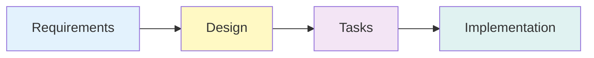

import SpecDrivenSource from '!!raw-loader!../../../../plugins/handbook-agent-spec-kit/skills/spec-driven/SKILL.md'
import CodeBlock from '@theme/CodeBlock';

# Use `spec-driven` skill

<span className="badge badge--handbook-agent-spec-kit">handbook-agent-spec-kit</span>

Orchestrator for spec-driven development workflow that coordinates specialized agents through four distinct phases with approval gates.

The `spec-driven` skill provides a systematic approach to feature development by coordinating four specialized agents: requirements-agent, tech-design-agent, tasks-agent, and implementation-agent. It ensures sequential execution with explicit user approval between phases.



## When to Use This Skill

Use the `spec-driven` skill when you want to:

- Follow a structured approach to feature development
- Create comprehensive requirements before design
- Ensure technical designs address all requirements
- Break down features into actionable coding tasks
- Implement with strict adherence to specifications
- Maintain traceability from requirements to implementation

Trigger with phrases like "use spec-driven development", "follow the spec process", or "use spec-driven approach".

## Skill Specification

<CodeBlock language="markdown">
{SpecDrivenSource}
</CodeBlock>

## Key Concepts

### Four-Phase Workflow

1. **Phase 1 - Requirements**: Transform feature idea into user stories with EARS acceptance criteria
   - Launches `requirements-agent`
   - Creates `specs/{feature_name}/requirements.md`
   - Approval gate: "Do the requirements look good?"

2. **Phase 2 - Design**: Create technical architecture addressing all requirements
   - Launches `tech-design-agent`
   - Creates `specs/{feature_name}/design.md`
   - Approval gate: "Does the design look good?"

3. **Phase 3 - Tasks**: Convert design into actionable coding tasks
   - Launches `tasks-agent`
   - Creates `specs/{feature_name}/tasks.md`
   - Approval gate: "Do the tasks look good?"

4. **Phase 4 - Implementation** (Optional): Execute tasks with strict zero-improvisation
   - Launches `implementation-agent`
   - One task per session
   - Updates task status in `tasks.md`

### Orchestrator-Only Pattern

The spec-driven skill is strictly an orchestrator - it NEVER creates documents or implements tasks itself. It only launches the appropriate subagent for each phase and manages approval gates.

### Explicit Approval Gates

The workflow never advances to the next phase without explicit user confirmation. This ensures quality and alignment at each stage.

## File Structure

All specifications are created in `specs/{feature_name}/`:

```
specs/user-authentication/
├── requirements.md    - User stories with EARS acceptance criteria
├── design.md         - Technical architecture and implementation guidance
└── tasks.md          - Incremental coding tasks with progress tracking
```

## Example Workflow

**User**: "I want to build a user authentication system"

**Phase 1**: Orchestrator launches `requirements-agent` → creates requirements.md → waits for approval

**Phase 2**: After approval, launches `tech-design-agent` → creates design.md → waits for approval

**Phase 3**: After approval, launches `tasks-agent` → creates tasks.md → waits for approval

**Phase 4**: User requests implementation → orchestrator launches `implementation-agent` for task 1 → suggests new session for task 2

## Related Components

- [`requirements-agent`](/component-reference/agents/requirements-agent) - Creates requirements with EARS acceptance criteria
- [`tech-design-agent`](/component-reference/agents/tech-design-agent) - Creates technical design documents
- [`tasks-agent`](/component-reference/agents/tasks-agent) - Converts designs into actionable tasks
- [`implementation-agent`](/component-reference/agents/implementation-agent) - Executes tasks with strict adherence
