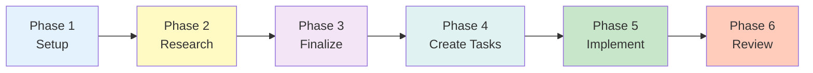

import StructuredPlanModeSource from '!!raw-loader!../../../../plugins/cc-handbook-extras/skills/structured-plan-mode/SKILL.md'
import CodeBlock from '@theme/CodeBlock';

# Use `structured-plan-mode` skill

<span className="badge badge--secondary">handbook-extras</span>

A structured approach for planning and tracking complex feature implementations through systematic task decomposition.

The `structured-plan-mode` skill provides a phased methodology for breaking down large, multi-component features into manageable tasks with clear goals, dependencies, and success criteria. It emphasizes iterative research, user collaboration, and disciplined task tracking throughout implementation.



## When to Use This Skill

Use the `structured-plan-mode` skill when you want to:

- Plan complex features requiring multiple components or integration points
- Manage multi-step implementations spanning several days with interdependent tasks
- Establish pattern-setting work that will guide future development
- Evaluate multiple approaches before committing to implementation
- Track progress systematically through large feature builds

**Do NOT use** for simple bug fixes, trivial features, one-off scripts, or work with a single clear implementation path.

## Skill Specification

<CodeBlock language="markdown">
{StructuredPlanModeSource}
</CodeBlock>

## Key Concepts

### Phased Approach

The skill follows a strict 6-phase workflow:

1. **Phase 1 - Setup**: Create plan skeleton with Phase 0 Research section
2. **Phase 2 - Research**: Explore codebase, propose strategies, iterate with user
3. **Phase 3 - Finalize**: Document selected approach with rationale
4. **Phase 4 - Task Creation**: Break down into implementation tasks (T001-T00N)
5. **Phase 5 - Implementation**: Track task completion in plan document
6. **Phase 6 - Review**: Document lessons learned

```mermaid
graph TD
    Start([User Request]) --> P1[Phase 1: Setup]
    P1 --> P1A[Create plan skeleton]
    P1A --> P1B[Add Phase 0 Research]
    P1B --> P2[Phase 2: Research & Iterate]

    P2 --> P2A[Explore codebase]
    P2A --> P2B[Document findings]
    P2B --> P2C[Propose 2-4 approaches]
    P2C --> P2D{AskUserQuestion}
    P2D -->|User feedback| P2B
    P2D -->|Approach confirmed| P3[Phase 3: Finalize]

    P3 --> P3A[Fill Selected Approach]
    P3A --> P3B[Document rationale]
    P3B --> P4[Phase 4: Create Tasks]

    P4 --> P4A[NOW create T001-T00N]
    P4A --> P4B[Define requirements]
    P4B --> P4C[Update Progress Summary]
    P4C --> P5[Phase 5: Implementation]

    P5 --> P5A[Execute tasks]
    P5A --> P5B[Track in plan document]
    P5B --> P5C{All tasks done?}
    P5C -->|No| P5A
    P5C -->|Yes| P6[Phase 6: Review]

    P6 --> P6A[Document lessons learned]
    P6A --> Done([Feature Complete])

    style P1 fill:#e3f2fd
    style P1A fill:#e3f2fd
    style P1B fill:#e3f2fd
    style P2 fill:#fff9c4
    style P2A fill:#fff9c4
    style P2B fill:#fff9c4
    style P2C fill:#fff9c4
    style P2D fill:#fff9c4
    style P3 fill:#f3e5f5
    style P3A fill:#f3e5f5
    style P3B fill:#f3e5f5
    style P4 fill:#e0f2f1
    style P4A fill:#e0f2f1
    style P4B fill:#e0f2f1
    style P4C fill:#e0f2f1
    style P5 fill:#c8e6c9
    style P5A fill:#c8e6c9
    style P5B fill:#c8e6c9
    style P5C fill:#c8e6c9
    style P6 fill:#ffccbc
    style P6A fill:#ffccbc
    style Start fill:#2196f3
    style Done fill:#4caf50
```



### TodoWrite Integration

The skill uses TodoWrite to track **only phases 1-4**, not individual subtasks:

```
- [ ] Phase 1: Setup template with Phase 0 Research section
- [ ] Phase 2: Conduct research and iterate with user
- [ ] Phase 3: Finalize selected approach
- [ ] Phase 4: Create implementation tasks (T001-T00N)
```

Phases 5-6 are tracked directly in the plan document.

### User Collaboration

Phase 2 emphasizes active iteration with the user through `AskUserQuestion`:
- Present 2-4 approach options with trade-offs
- Get user input on preferences and assumptions
- Iterate until user explicitly confirms the preferred approach
- User feedback may correct assumptions—update research accordingly

### No Premature Planning

Tasks (T001, T002, etc.) are created **only in Phase 4**, after Phase 0 research is complete and the approach is confirmed. This prevents wasted planning effort on approaches that won't be selected.

## Example Workflow

**User Request**: "Add real-time collaboration features to the document editor"

**Phase 1**: Create plan with Phase 0 Research section (no T001-T003 yet)

**Phase 2**:
- Research WebSocket libraries, existing real-time features
- Propose 3 approaches: WebRTC, WebSockets, or Firebase
- Use AskUserQuestion to present trade-offs
- User confirms WebSockets approach

**Phase 3**: Document selected approach with rationale in Phase 0

**Phase 4**: Create tasks:
- T001: Implement WebSocket server
- T002: Add client connection handling
- T003: Sync document state
- T004: Handle conflict resolution
- T005: Add presence indicators

**Phase 5-6**: Execute tasks, document lessons learned

## Success Indicators

Effective use of this skill shows:
- ✅ TodoWrite tracks phases, not subtasks
- ✅ Phase 0 created first, T001-T00N created later
- ✅ AskUserQuestion used multiple times for iteration
- ✅ Selected approach documented only after user confirmation
- ✅ Task count matches complexity (1-2 simple, 3-5 medium, 5+ complex)
- ✅ Clear rationale for approach selection
- ✅ Tasks sized appropriately (2-5 days each)

## Related

- [skill-creator](./skill-creator.mdx) - Create new skills and workflows to extend Claude's capabilities