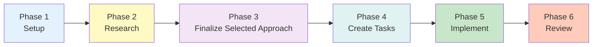
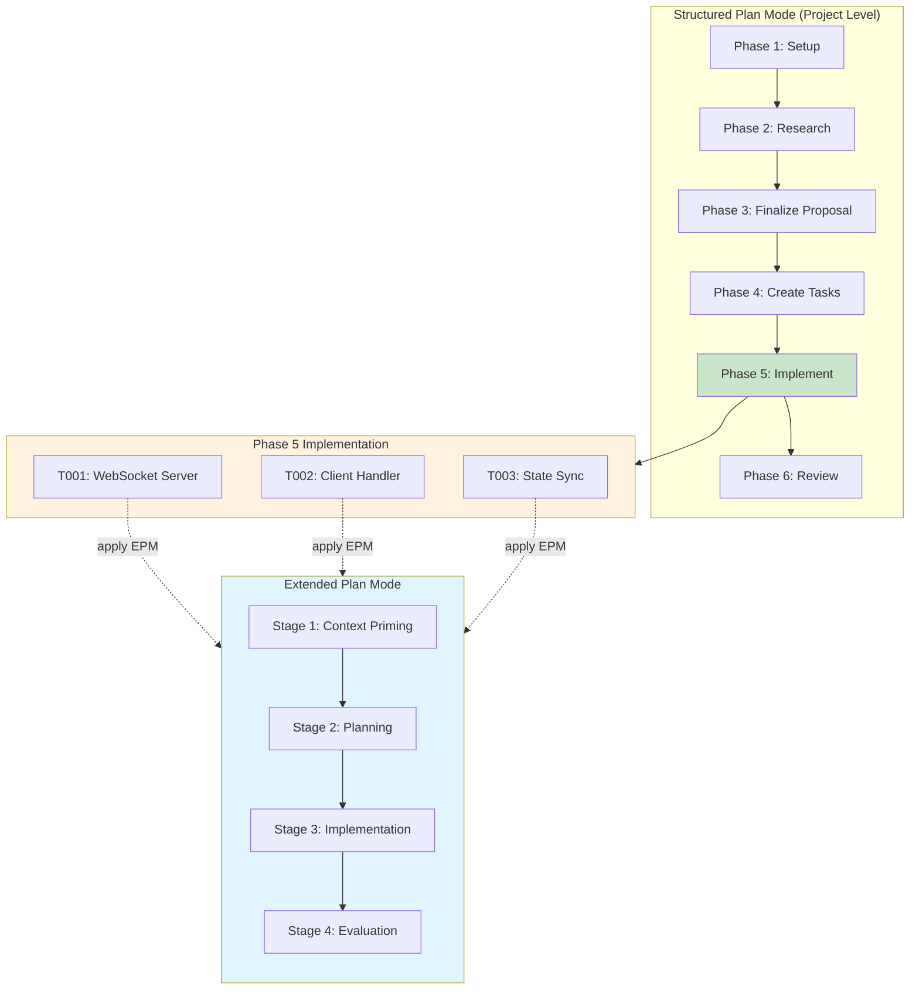

# Use Structured Plan Mode

For highly complex feature implementations requiring systematic planning and tracking, the `structured-plan-mode` skill provides a disciplined, phased approach to break down work into manageable pieces.

For complete the full skill specification, see the [structured-plan-mode reference](/component-reference/skills/structured-plan-mode).

## What is Structured Plan Mode?

Structured Plan Mode is a skill that guides you through a 6-phase methodology for planning and implementing complex features:

## When to Use

Use Structured Plan Mode when:

- **Multi-component features**: Work spans multiple integration points or systems
- **Extended timelines**: Implementation will take several days with interdependent tasks
- **Multiple approaches**: Need to evaluate different implementation strategies
- **Pattern-setting work**: Decisions will guide future development
- **High complexity**: Clear task decomposition and tracking are critical

**Do NOT use** for simple bug fixes, trivial features, one-off scripts, or work with a single obvious implementation path.

## Key Principles

### Phased Progression

The skill enforces strict phase ordering:

1. **Setup** - Create `.plans/[feature-name]/` structure with plan.md and research section
2. **Research** - Explore codebase, propose strategies, and iterate with user
3. **Finalize Selected Approach** - Document selected approach in plan.md
4. **Task Creation** - Break down into task files (T01.md - T0N.md) in `.plans/[feature-name]/tasks/`
5. **Implementation** - Execute and track tasks in individual task files
6. **Review** - Document lessons learned in plan.md

## Comparison with [Extended Plan Mode](./extended-plan-mode)

| Aspect | Extended Plan Mode | Structured Plan Mode |
|--------|-------------------|---------------------|
| **Use Case** | Small/Medium features | Complex implementations requiring systematic planning |
| **Research** | Use Context Priming | Dedicated Research phase with iteration |
| **User Involvement** | Review plan before implementation + `AskUserQuestion` | Active iteration during research phase using `AskUserQuestion` |
| **Task Tracking** | `TodoWrite` for tasks and milestones | `TodoWrite` for phases 1-4 only; tasks tracked in plan doc |
| **Best For** | Production code with quality focus | Multi-component features with multiple approaches |

## Benefits

- **Systematic decomposition**: Complex work broken into clear, manageable tasks
- **Reduced rework**: Research and iteration happen before detailed planning
- **Clear progress tracking**: Know exactly where you are in the implementation
- **Knowledge capture**: Lessons learned documented for future reference
- **Collaborative decision-making**: User input guides approach selection

## Combining with Extended Plan Mode

*Structured Plan Mode* and *Extended Plan Mode* are **complementary, not exclusive**. While *Structured Plan Mode* provides the framework for complex modules/components/features/tasks, *Extended Plan Mode* can be applied to individual tasks within Phase 5 (Implementation).

### Nested Workflow

## Example Workflow

**Request**: "Add real-time collaboration to document editor"

**Phase 1**: Create plan skeleton with Research section

**Phase 2**:
- Research WebSocket libraries, existing features
- Propose 3 approaches: WebRTC, WebSockets, Firebase
- Ask clarifying questions with `AskUserQuestion`, iterate with user
- Present trade-offs
- User confirms the end of research

**Phase 3**: Document selected WebSockets approach with rationale

- User confirms WebSockets
- Document rationale and key findings for WebSockets approach

**Phase 4**: Create task files (T01.md: WebSocket server, T02.md: Client handling, etc.) in `.plans/collaboration-feature/tasks/`

**Phase 5-6**: Implement and track progress in individual task files, document lessons

## Learn More

For complete details, workflow diagrams, and the full skill specification, see the [structured-plan-mode reference](/component-reference/skills/structured-plan-mode).

## Related Topics

- [Use Extended Plan Mode](./extended-plan-mode) - Multi-stage approach for complex features
