# Understanding Building Blocks

Claude Code offers five powerful customization features that work together to enhance your development workflow. Understanding when to use each one helps you create efficient, maintainable setups.

## Quick Reference Matrix

| Feature            | Invocation          | Purpose                                    | Context Impact                                      |
| ------------------ | ------------------- | ------------------------------------------ | --------------------------------------------------- |
| **CLAUDE.md**      | Auto                | Persistent instructions & preferences      | Additive to system prompt                           |
| **Slash Commands** | Manual (main)/Auto  | Reusable prompt templates                  | Single interaction, has parameters                  |
| **Subagents**      | Auto/Manual         | Separate AI with own system prompt         | Separate context window and system prompt           |
| **Agent Skills**   | Auto                | Modular capabilities (no separate context) | Automatically loaded into current context on demand |
| **Output Styles**  | Manual Session-wide | Change interaction mode                    | Replaces system prompt                              |

> 💡 **Key Insight**: Both **Subagents** and **Agent Skills** can be automatically triggered, but they serve different purposes:
> - **Subagents** = Separate AI agent with its own system prompt and context window (can also be manually invoked)
> - **Agent Skills** = Capabilities loaded into the current agent's context (always automatic, no separate context)
> - **Subagents can use Skills**: A security-auditor subagent could leverage a vulnerability-scanner skill!

## Decision Flowchart

```mermaid
flowchart TD
    Start([Need to customize CC?]) --> Q1{Change entire<br/>conversation mode?}
    Q1 -->|Yes| OutputStyles[🎨 Output Styles]
    Q1 -->|No| Q2{Persistent across<br/>all sessions?}
    Q2 -->|Yes| Memory[📝 CLAUDE.md Memory]
    Q2 -->|No| Q3{Manually trigger<br/>a prompt?}
    Q3 -->|Yes| Slash[⚡ Slash Commands]
    Q3 -->|No| Q4{Need separate context<br/>and system prompt?}
    Q4 -->|Yes| Subagents[🤖 Subagents]
    Q4 -->|No| Q5{Auto-triggered<br/>capability?}
    Q5 -->|Yes| Skills[🔧 Agent Skills]
    Q5 -->|No| Reconsider[❓ Reconsider 🙂]

    OutputStyles --> Examples1["Learning mode,<br/>Explanatory mode"]
    Memory --> Examples2["Code standards,<br/>Architecture docs"]
    Slash --> Examples3["review, commit, deploy"]
    Subagents --> Examples4["Security auditor,<br/>Test generator<br/>separate persona"]
    Skills --> Examples5["Skills on-demand"]

    style Start fill:#e1f5ff
    style OutputStyles fill:#fff4e6
    style Memory fill:#e8f5e9
    style Slash fill:#f3e5f5
    style Subagents fill:#fce4ec
    style Skills fill:#fff9c4
```



## When Features Activate


## Real-World Scenarios

### Scenario 1: Code Review Workflow
**Best Choice: Slash Command**

- You control when reviews happen
- Consistent review criteria
- Parameterized (which file to review)

```bash
/review 'src/components/UserProfile.tsx'
```

### Scenario 2: Persistent Coding Standards
**Best Choice: CLAUDE.md**
- Applies to every conversation
- Team-shared via git
- No manual invocation needed

### Scenario 3: Security Audit
**Best Choice: Subagent**


- Specialized security expertise
- Separate context (doesn't clutter main chat)
- Different tool permissions (read-only)

### Scenario 4: Learning Mode
**Best Choice: Output Style**
- Changes entire interaction style
- Educational explanations throughout
- Collaborative problem-solving

### Scenario 5: PDF Report Generation
**Best Choice: Agent Skill**
- Claude activates when you mention "create a report"
- Complex workflow (template selection, styling, generation)
- Multi-file supporting resources

Why not use a Slash Command? Because you want this to happen automatically when relevant, without manual triggers. It enhances an agent/subagent with on-demand loaded capabilities.


## Feature Relationships

```mermaid
graph TB
    subgraph System["System Prompt Architecture"]
        Base[Base System Prompt]
        Style[Output Style]
        Memory[CLAUDE.md]

        Style -.replaces.-> Base
        Memory -.adds to.-> Base
    end

    subgraph Invocation["Invocation Models"]
        User[👤 User]
        Claude[🤖 Claude]
        Auto[⚙️ Automatic]

        User -->|types| SlashCmd["slash command"]
        User -->|delegates| Agent[Subagent]
        Claude -->|invokes| Agent
        Claude -->|activates| Skill[Skill]
        Auto -->|loads| Memory
    end

    subgraph Context["Context Management"]
        Main[Main Context Window]
        Separate[Separate Context Window]
        OnDemand[On-Demand Loading]

        SlashCmd --> Main
        Memory --> Main
        Agent --> Separate
        Skill --> OnDemand
    end

    style Base fill:#e3f2fd
    style Style fill:#fff4e6
    style Memory fill:#e8f5e9
    style User fill:#f3e5f5
    style Claude fill:#e1bee7
    style Auto fill:#c5cae9
```



## Key Takeaways


1. **CLAUDE.md**: "Always-on" context and preferences
2. **Slash Commands**: Manual prompt shortcuts you control
3. **Subagents**: Separate AI with own system prompt and isolated context (auto or manual)
4. **Output Styles**: Change the conversation mode itself
5. **Agent Skills**: Automatic capabilities loaded into current agent (no separate context)

Understanding these distinctions helps you choose the right tool for each task and build efficient, maintainable development workflows.

## Next Steps

Now that you understand these individual features, you can bundle them together using [Plugins](./use-plugins) to create shareable, reusable development environments.

## Related Topics

- [Custom Slash Commands](./custom-slash-commands)
- [Create Custom Subagents](./subagents)
- [Use Agent Skills](./agent-skills)
- [Use Plugins](./use-plugins)
