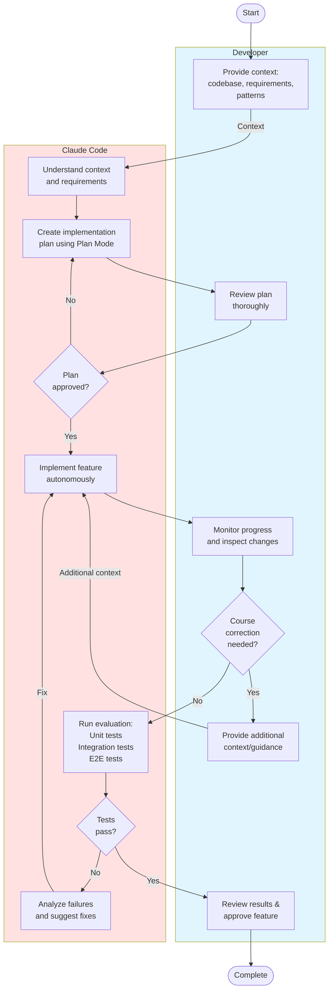

# Use Extended Plan Mode

A structured multi-stage approach for implementing features with Claude Code:

**Stage 1: Context Priming**
- Provide Claude with proper context about the codebase
- Share requirements and implementation details
- Help Claude understand existing patterns and architecture

**Stage 2: Planning**
- Use Claude Code's **Plan Mode** to create an implementation plan
- Review the plan thoroughly before proceeding
- Ensure all edge cases and requirements are covered

**Stage 3: Implementation**
- Let Claude Code follow the plan autonomously
- Monitor progress and inspect changes as they happen
- Provide additional context or course-correct if needed

**Stage 4: Evaluation**
- Enable Claude Code to evaluate the task outcome
- Use unit tests and integration tests for validation
- For frontend changes, use Playwright or similar tools to verify visual results

**When to use:** Complex feature development requiring multiple steps and verification. Ideal for production code where quality and correctness are critical.

:::tip
Act as a supervisor during implementation - stay engaged but let Claude work through the plan independently.
:::

:::tip
The evaluation stage is very important - having automated tests or visual verification tools ready before starting saves time and ensures quality.
:::

