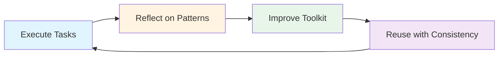

# Incrementally Evolve Your CC Setup

One of the most powerful but often overlooked practices in working with Claude Code is treating your setup as a living, evolving system. After completing tasks, take a moment to reflect and package your learnings into reusable components. This iterative approach transforms one-off solutions into a refined toolkit that grows more valuable over time.

## The Improvement Cycle

Effective Claude Code usage follows a continuous improvement pattern:



### 1. Execute Tasks

Work with Claude Code on your daily development tasks - debugging, refactoring, feature implementation, documentation, etc.

### 2. Reflect on Patterns

After completing a task, ask yourself:
- **What worked well?** Which prompts, workflows, or approaches were particularly effective?
- **What was repetitive?** Did I find myself giving similar instructions multiple times?
- **What could be standardized?** Are there patterns that would benefit others on my team?
- **What context was crucial?** What background information or constraints made the task successful?

### 3. Improve Your Toolkit

Based on your reflections, update your Claude Code artifacts:

- **Skills**: Package complex workflows with specialized knowledge
- **Slash Commands**: Create shortcuts for frequently-used prompts
- **Agents**: Define specialized agent personas for domain-specific tasks
- **CLAUDE.md**: Document project-specific patterns and constraints
- **Hooks**: Automate quality checks and enforce standards

### 4. Reuse with Consistency

Next time you face a similar task, your refined toolkit provides:
- **Consistency**: Standardized approaches across your team
- **Efficiency**: Less time explaining context and requirements
- **Quality**: Accumulated best practices and lessons learned
- **Knowledge Sharing**: Teammates benefit from your discoveries

## Recognizing When to Package Patterns

Not every task needs to become a skill or command. Look for these signals:

### ✅ Good Candidates for Packaging

- **Repetition**: You've performed similar tasks 3+ times
- **Complexity**: The workflow has multiple steps or specific requirements
- **Domain Knowledge**: Specialized expertise that benefits from documentation
- **Team Value**: Others on your team would benefit from this capability
- **Context Dependency**: Success requires specific background information

### ❌ Skip Packaging When

- **One-off tasks**: Unlikely to repeat
- **Too generic**: Already covered by Claude's base capabilities
- **Highly variable**: Requirements change significantly each time
- **Quick and simple**: Takes longer to package than to re-explain

## Leveraging Skills

One of the fastest ways to evolve your setup is using skills - reusable components that encapsulate specific functionality.

### The `skill-creator` Skill

The cc-handbook plugin includes [`skill-creator`](/component-reference/skills/skill-creator), a skill that helps you design and implement new skills following Anthropic's best practices.

**Benefits:**
- **Rapid Development**: Quickly scaffold well-structured skills
- **Best Practices**: Automatically incorporates Anthropic's recommendations
- **Consistent Quality**: Ensures all your skills follow proven patterns
- **Learning Tool**: See examples of effective skill design

**Usage Example:**

```
You: "I keep debugging database connection issues. Help me create
     a skill for systematic database troubleshooting."

Claude: [Uses skill-creator to design a comprehensive database
         debugging skill with progressive disclosure, proper
         tool coordination, and clear decision trees]
```

The `skill-creator` skill handles:
- Structuring your skill with appropriate frontmatter
- Organizing instructions for progressive disclosure
- Suggesting relevant bundled resources (scripts, references)
- Applying tool access restrictions when appropriate

See the [skill-creator reference](/component-reference/skills/skill-creator) for complete details.

For more on skills, see [Use Agent Skills](/tips-and-tricks/agent-skills)

## Best Practices

* **Start Small** - Don't try to package everything at once. Begin with your most repetitive task and refine from there.

* **Iterate Based on Use** - The first version of a skill/command doesn't need to be perfect. Use it, learn what's missing, and improve it.

* **Share with Your Team** - Project-level skills in `.claude/skills/` are shared via git. Your improvements help everyone.

* **Review Periodically** - Every few weeks, review your skills and commands: Are they still relevant? Can they be simplified? Should they be combined or split?
